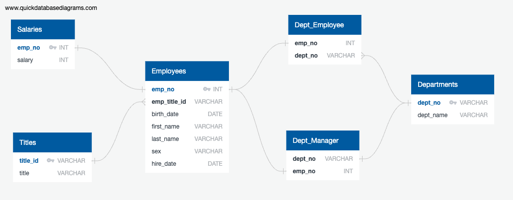

# sql-challenge  
* Research project aobut people employed at Pewlett Hackard during 1980s & 1990s.
* Provided with 6 CSV files from employee database:  
    * departments, 
    * dept_emp, 
    * dept_manager, 
    * employees, 
    * salaries, 
    * titles.

## Data Modeling  
* After inspecting CSV files, sketched an Entity Releationship Diagram of the tables using QuickDBD.  
    

## Data Engineering  

## Data Analysis  

