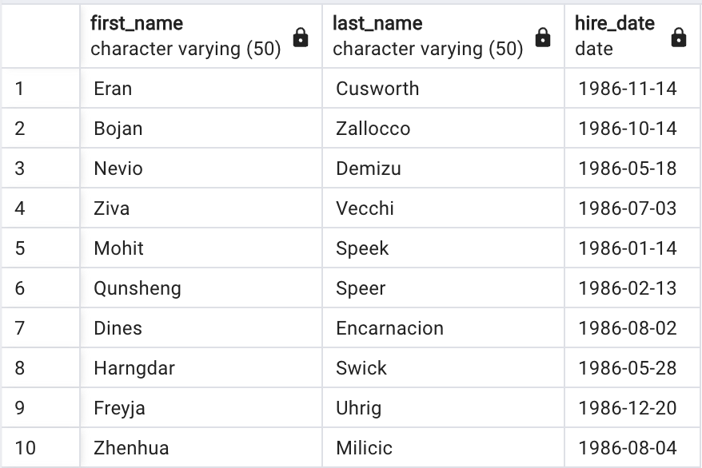

# sql-challenge  
* Research project aobut people employed at Pewlett Hackard during 1980s & 1990s.
* Provided with 6 CSV files from employee database:  
    * departments, 
    * dept_emp, 
    * dept_manager, 
    * employees, 
    * salaries, 
    * titles.

## Data Modeling  
* After inspecting CSV files, sketched an Entity Releationship Diagram of the tables using QuickDBD.  
    

## Data Engineering  
* Created table schemas for each of the 6 CSV files.  
* Imported each CSV file into its corresponding SQL table.

## Data Analysis  
* Listed the employee number, last name, first name, sex, and salary of each employee.  
    
* Listed the first name, last name, and hire date for the employees who were hired in 1986.  
    
* Listed the manager of each department along with their department number, department name, employee number, last name, and first name.  
    
* Listed the department number for each employee along with that employee’s employee number, last name, first name, and department name.  
    
* Listed the first name, last name, and sex of each employee whose first name was Hercules and whose last name began with the letter B.  
    
* Listed each employee in the Sales department, including their employee number, last name, and first name.  
    
* Listed each employee in the Sales and Development departments, including their employee number, last name, first name, and department name.  
    
* Listed the frequency counts, in descending order, of all the employee last names (that is, how many employees shared each last name).  
    